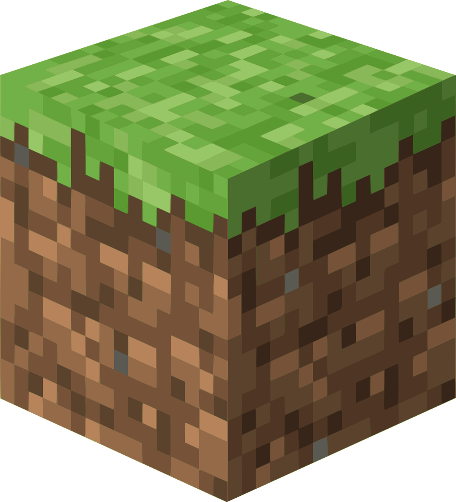

<h1>mc-js</h1>

3D Voxel Game, made in pure JS  

<strong>Chiril Barba</strong>

---

## Educational & Non-Commercial Disclaimer

**This project is a strictly non-commercial, from-scratch software engineering re-implementation created solely for educational, architectural, and portfolio purposes as part of my engineering studies.** 

* **No Commercial Intent:** This project is not for sale, will never be monetized, and does not accept donations or financial support of any kind. 

* **Fair Use:** The inclusion of visual assets is intended strictly for demonstrative, educational analysis to evaluate the game logic, physics, and rendering pipeline accuracy under realistic conditions.

---

[Versions](./version.md)