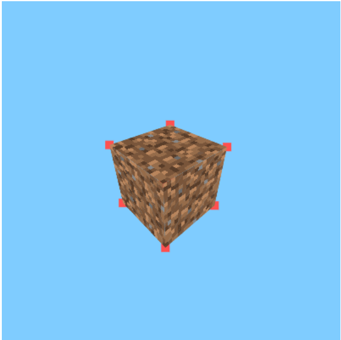
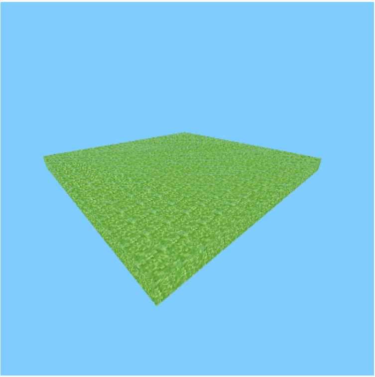
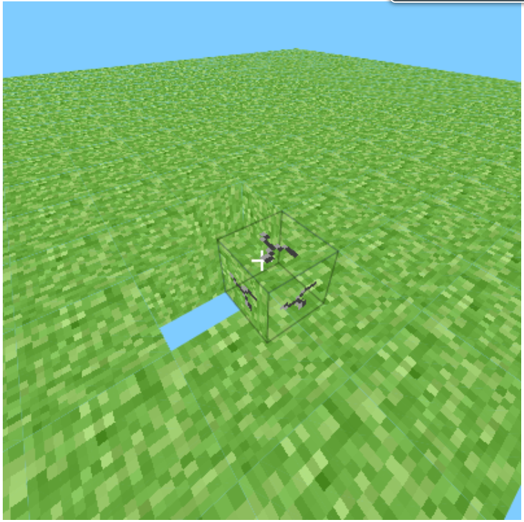

## Version History:

- 0.0.0

    - Able to render a cube on a 3D space.
    - Able to control movements and camera direction.
    - Added Basic Test Textures.
    - Added a basic Culling Effect (1 block only).
    - Added Texture Tesselation (Canvas API does not support it :( - Anti-Warps textures)
    - Optimized textures to render more texture triangles depending on the camera's range.

    Demo: 
    

- 0.0.1

    - Generated a chunk (16x16 blocks) of Grass.
    - Seperated Blocks as a class.
    - Added Multiple Culling Effects to render a more steady grass field.
    
    Demo:
    

- 0.0.2

    - Used Raycast technique to Delete a Block (Breaking a block).
    - Added a crossair to aim.
    - Added a wireframe on aim selection.
    - Added a break animation.

    
